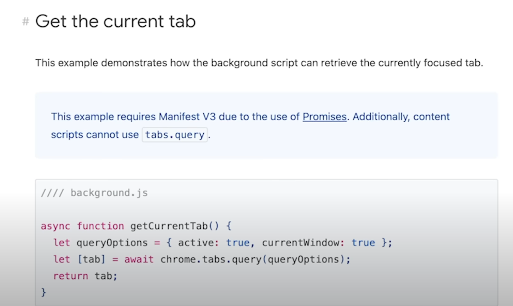

# Chrome-Extension

Goals:

[https://www.youtube.com/playlist?list=PLRqwX-V7Uu6bL9V](https://www.youtube.com/playlist?list=PLRqwX-V7Uu6bL9VOMT65ahNEri9uqLWfS)[OMT65ahNEri9uqLWfS](https://www.youtube.com/playlist?list=PLRqwX-V7Uu6bL9VOMT65ahNEri9uqLWfS)

https://developer.chrome.com/docs/extensions/reference/api

Chrome extension api documentation

https://developer.chrome.com/docs/extensions/reference/api

Kevin's notes

https://youtu.be/0n809nd4Zu4?si=8qNDgQOirIUcPb1Z&t=340

we need a manifest.json file to create a chrome extension

Example of one:

{

  "name": "My YT Bookmarks", // whatever name we want

  "version": "0.1.0", // can be any version number

  "description": "Saving timestamps in YT videos", // whatever we want

  "permissions": ["storage", "tabs"],  // will be different, we request access to chrome.storage api and chrome. tabs api

// storage allows stuff to be stored inside the extension

//tabs allows the extension to access the tabs system

//host permissions allows the extension to send a cors request to whatever website we want

  "host_permissions": ["https://*.youtube.com/*"],

// service workers is a js file that runs separately from the main browser thread. introuced in manifest v3

// it will have access to the contents of a webpage

// the service worker will be able to speak to our extensione

  "background": {

    "service_worker": "background.js"

  },

//will run the js file in the webpage that we specify

  "content_scripts": [

    {

// checks if any youtube video is loaded and then loads our content script

    "matches": ["https://*.youtube.com/*"],

    "js": ["contentScript.js"]

    }

  ],

  "web_accessible_resources": [

    {

    "resources": [

    "assets/bookmark.png",

    "assets/play.png",

    "assets/delete.png",

    "assets/save.png"

    ],

    "matches": ["https://*.youtube.com/*"]

    }

  ],

  "action": {

    "default_icon": {

    "16": "assets/ext-icon.png",

    "24": "assets/ext-icon.png",

    "32": "assets/ext-icon.png"

    },

    "default_title": "My YT Bookmarks",

// will specify the UI that shows up

    "default_popup": "popup.html"

  },

  "manifest_version": 3

}

// contents.js file

chrome.runtime.onMessage.addListener((obj,sender,response)=>{

const {type,value,videoId }= obj

}})

// to check for updates from video however maybe we can make it check for when the page changes?

if(type === "NEW"){

currentVideo = videoId;

newVideoLoaded())

}

//background.js

// to liisten to the tabs whenever youg et a new youtube ideo maybe we can listen to when a tab gets updates

chrome.tabs.onUpdate.addListener((tabId,tab))

if(tab url  ) .includes(youtube/watch)

// create an image element

const bookmarkbtn = document.createelement("img")

bookmarkBt.src = chrome.runtime.getUrl("png")

bookmarkbtn.classname = "whatever name you want it"

bookmarkbtn.title= "whatever you want "

// grab elements

whateverElementYouWant =document.getElemenstByClassname("")

// append child

// this will append an existing div or whatever using an element you create

 whateverElementYouWant.append(bookmarkBtn)

// chrome storage time must be stored in json and this is how one would grab

// chrome.storage.sync.set({

})

// [curreNtVideo]:  JSON.stringify([...currentVideoBookmarks,newBookmark.sort)

// fetching from chromStorage API based on current youtube video. maybe we can make it so it can grab current webpage

// fetchBookMarks =()=>{

return new Promise((resolve)=>{

chrome.storage.syn.get([currentVide),obj =>{

resolve(objj[currentVideo) > JSON.parse(obj)[currentVideo} :[];

}})

}}

// get the currently focused tab might be useful to get the current focused tab

// when an html document is loaded

// docuement.addEventListener("DOMCOntentLoad",async()=>{

const activeTabe  = await getActiveTabURL();

const queryParameters = activeTab.

const URLparameters = new URLSearchPArams

}}))

//

https://developer.chrome.com/docs/extensions/reference/manifest#minimal-manifest

// Manifest file format

// 5 options

// minimal manifest

// register a content script

// injecting a content script

// popup with permissions

// how to have a side panel

// Icons

//

https://developer.chrome.com/docs/extensions/reference/api/action
